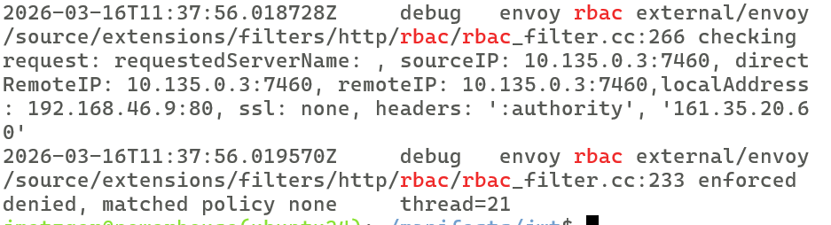

# Istio Authorization Policies – Zero Trust mit Bookinfo

## Ziel

In dieser Übung setzen wir **Zero Trust** im Mesh um:  
**Deny All → explizit erlauben, was nötig ist.**

Jeder Service darf nur mit den Services kommunizieren, die er tatsächlich braucht – und nur über die erlaubten HTTP-Methoden und Pfade.

## Voraussetzungen

- Kubernetes-Cluster mit Istio (Sidecar)
- Bookinfo-App deployed im Namespace `bookinfo`
- mTLS im Mesh aktiv (Default: `STRICT` oder `PERMISSIVE` mit PeerAuthentication)
- Gateway konfiguriert (Gateway API oder Istio Ingress Gateway)

## Architektur – Bookinfo Traffic Flow

```
Client → Gateway → productpage → reviews → ratings
                                → details
```

- `productpage` ruft `reviews` und `details` auf
- `reviews` (v2/v3) ruft `ratings` auf
- `details` hat keine Downstream-Dependencies

---

## Schritt 1: GATEWAY_IP setzten

```
# IP notieren 
kubectl -n bookinfo get gateway 
GATEWAY_IP=<ip-des-gateways>
```

## Schritt 2 Projekt-Ordner setzen 

```
cd
mkdir -p manifests/zero-trust-rbac
cd manifests/zero-trust-rbac  
```

## Schritt 3: mTLS verifizieren

Bevor Authorization Policies greifen, muss mTLS aktiv sein. Ohne mTLS funktionieren `source.principals` und `source.namespaces` nicht.

```bash
# PeerAuthentication prüfen
kubectl get peerauthentication -A
```

```bash
# Falls nicht vorhanden, mesh-weit STRICT setzen
kubectl apply -f - <<EOF
apiVersion: security.istio.io/v1
kind: PeerAuthentication
metadata:
  name: default
  namespace: istio-system
spec:
  mtls:
    mode: STRICT
EOF
```

### Verifizieren

```bash
# Aus einem Pod ohne Sidecar sollte der Zugriff fehlschlagen
# weil dieser die Verbindung plaintext und nicht verschlüsselt aufbaut
kubectl run test-no-mesh --image=busybox --rm -it -n default 
```

```
# in der shell
wget -O - http://productpage.bookinfo:9080/productpage
# ** Erwartung: ** Connection reset by peer (kein mTLS-Zertifikat)
```
---

## Schritt 4: Deny All – Alles sperren

Die Basis von Zero Trust: **Erstmal alles verbieten.**

Eine leere `AuthorizationPolicy` ohne Rules mit impliziter `ALLOW`-Action blockiert sämtlichen Traffic im Namespace.

```bash
kubectl apply -f - <<EOF
apiVersion: security.istio.io/v1
kind: AuthorizationPolicy
metadata:
  name: deny-all
  namespace: bookinfo
spec: {}
EOF
```

### Verifizieren

```bash
# Über den Browser oder curl auf die Productpage zugreifen
curl -s -o /dev/null -w "%{http_code}" http://<GATEWAY_IP>/productpage
# Erwartung: 403 Forbidden
```

> **Erklärung:** Eine Policy mit `spec: {}` (keine `action`, keine `rules`) bedeutet:  
> Action ist implizit `ALLOW`, aber es gibt keine Rules die matchen → kein Request wird erlaubt.

---

## Schritt 5: Gateway → productpage erlauben

Der erste erlaubte Pfad: Das Gateway darf die Productpage erreichen.

```bash
kubectl apply -f - <<EOF
apiVersion: security.istio.io/v1
kind: AuthorizationPolicy
metadata:
  name: allow-productpage-from-gateway
  namespace: bookinfo
spec:
  selector:
    matchLabels:
      app: productpage
  action: ALLOW
  rules:
  - from:
    - source:
        principals: ["cluster.local/ns/bookinfo/sa/bookinfo-gateway-istio"]
    to:
    - operation:
        methods: ["GET"]
        paths: ["/productpage", "/static/*", "/login", "/logout", "/api/v1/products*"]
EOF
```

> **Hinweis:** Bei Gateway API mit Waypoint Proxy oder anderem Setup muss der `principals`-Wert angepasst werden.  
> Den korrekten Service Account findest du mit:
> ```bash
> kubectl get pods -n istio-system -l app=istio-ingressgateway -o jsonpath='{.items[0].spec.serviceAccountName}'
> ```

### Verifizieren

```bash
curl -s -o /dev/null -w "%{http_code}" http://$GATEWAY_IP/productpage
# Erwartung: 200 OK – aber die Seite zeigt Fehler für Reviews und Details (noch blockiert)
```

  * Aber: Es ist 403. 

---

## Schritt 6: Problem rbac debuggen (am productpage - sidecar) 

```
# Kommt die Anfrage am productpage (sidecar- container an) ?
# Dazu müssen wir zunächst wissen, ob rbac:debug gesetzt ist, nur dann sehen wir etwas
istioctl proxy-config log deploy/productpage-v1 -n bookinfo | grep rbac
# Falls nicht rbac: debug,  jetzt setzen:
istioctl proxy-config log deploy/productpage-v1 -n bookinfo --level rbac:debug
```

```
# Anfrage nochmal absetzen und Log überprüfen
curl -s -o /dev/null -w "%{http_code}" http://$GATEWAY_IP/productpage
# Es kommt nichts an
kubectl logs -n bookinfo deploy/bookinfo-gateway-istio -c istio-proxy --tail=30 | grep rbac
```

  * **Resultat**: Da kommt nichts an, das Problem muss also davor sein: AM Gateway 


## Schritt 7: Problem rbac (am gateway - pod) identifizieren 

### Situation: 

  * Anfrage kommt garnicht bis productpage -> Sidecar
  * Problem muss also vorher bereits existieren
  * Vermutung: Am Gateway

### Debuggen

```
# Gateway verifizieren
kubectl -n bookinfo get gateway
# Dies erzeugt einen Pod -> Das ist unser Freund 
kubectl -n bookinfo get pods | grep gateway
```

```
# rbac einschalten / Abfrage absenden und nochmal überprüfen 
istioctl proxy-config log deploy/bookinfo-gateway-istio -n bookinfo --level rbac:debug
curl -s http://$GATEWAY_IP/productpage
kubectl logs -n bookinfo deploy/bookinfo-gateway-istio -c istio-proxy --tail=30 | grep rbac
```




## Schritt 8: Problem rbac (am gateway - pod) lösen 

   * Anfragen werden nicht durchgelassen, die vom Web-Browser kommen 
   * Diese müssen erlaubt werden 

```
# Hier sehen wir die labels 
kubectl -n bookinfo get pods --show-labels | grep gateway
```
nano allow-gateway-inbound.yaml 
```

```
apiVersion: security.istio.io/v1
kind: AuthorizationPolicy
metadata:
  name: allow-gateway-inbound
  namespace: bookinfo
spec:
  selector:
    matchLabels:
      gateway.networking.k8s.io/gateway-name=bookinfo-gateway
  rules:
  - to:
    - operation:
        methods: ["GET"]
        paths: ["/productpage", "/static/*", "/login", "/logout", "/api/v1/products*"]
```

```
kubectl apply -f . 
```

```
# Nochmal testen 
# Gibt es für das gateway jetzt eine Policy 
istioctl x authz check deploy/bookinfo-gateway-istio -n bookinfo 
```

```
# Nochmal aufrufen
curl -s -o /dev/null -w "%{http_code}" http://$GATEWAY_IP/productpage
```

```
# For fun: wie seht RBAC - Eintrag aus 
kubectl logs -n bookinfo deploy/bookinfo-gateway-istio -c istio-proxy --tail=30 | grep rbac
```

 * Ergebnis: Es klappt. Eintrag: allowed by default or by policy 
 ```


## Schritt 9: productpage → details erlauben

```bash
kubectl apply -f - <<EOF
apiVersion: security.istio.io/v1
kind: AuthorizationPolicy
metadata:
  name: allow-details
  namespace: bookinfo
spec:
  selector:
    matchLabels:
      app: details
  action: ALLOW
  rules:
  - from:
    - source:
        principals: ["cluster.local/ns/bookinfo/sa/bookinfo-productpage"]
    to:
    - operation:
        methods: ["GET"]
        paths: ["/details/*"]
EOF
```

### Verifizieren

```bash
# Achtung es kann einen Moment dauern, bis die Rechte im Mesh bekannt sind 
curl -s http://$GATEWAY_IP/productpage | grep -o "Book Details"
# Erwartung: "Book Details" erscheint – Details-Section wird angezeigt
```

---

## Schritt 10: productpage → reviews erlauben

```bash
kubectl apply -f - <<EOF
apiVersion: security.istio.io/v1
kind: AuthorizationPolicy
metadata:
  name: allow-reviews
  namespace: bookinfo
spec:
  selector:
    matchLabels:
      app: reviews
  action: ALLOW
  rules:
  - from:
    - source:
        principals: ["cluster.local/ns/bookinfo/sa/bookinfo-productpage"]
    to:
    - operation:
        methods: ["GET"]
        paths: ["/reviews/*"]
EOF
```

---

## Schritt 11: reviews → ratings erlauben

```bash
kubectl apply -f - <<EOF
apiVersion: security.istio.io/v1
kind: AuthorizationPolicy
metadata:
  name: allow-ratings
  namespace: bookinfo
spec:
  selector:
    matchLabels:
      app: ratings
  action: ALLOW
  rules:
  - from:
    - source:
        principals: ["cluster.local/ns/bookinfo/sa/bookinfo-reviews"]
    to:
    - operation:
        methods: ["GET"]
        paths: ["/ratings/*"]
EOF
```

### Verifizieren

```bash
curl -s http://<GATEWAY_IP>/productpage | grep -o "Ratings"
# Erwartung: Ratings werden angezeigt (Sterne bei reviews v2/v3)
```

---

## Schritt 12: Gesamtstatus prüfen

```bash
# Alle Authorization Policies auflisten
kubectl get authorizationpolicies -n bookinfo

# Erwartete Ausgabe:
# NAME                             AGE
# deny-all                         ... 
# allow-gateway-inbound            ...
# allow-productpage-from-gateway   ...
# allow-details                    ...
# allow-reviews                    ...
# allow-ratings                    ...
```

### Negativtests – Nicht erlaubte Kommunikation

```bash
# Test 1: ratings darf NICHT direkt von productpage aufgerufen werden
kubectl exec deploy/productpage-v1 -n bookinfo -c productpage -- \
  curl -s -o /dev/null -w "%{http_code}" http://ratings:9080/ratings/0
# Erwartung: 403

# Test 2: details darf NICHT reviews aufrufen
kubectl exec deploy/details-v1 -n bookinfo -c details -- \
  curl -s -o /dev/null -w "%{http_code}" http://reviews:9080/reviews/0
# Erwartung: 403

# Test 3: POST auf productpage ist nicht erlaubt (nur GET)
kubectl exec deploy/sleep -n bookinfo -c sleep -- \
  curl -s -o /dev/null -w "%{http_code}" -X POST http://productpage:9080/productpage
# Erwartung: 403
```

---

## Schritt 13: DENY-Policy – Explizit blockieren

DENY-Policies werden **vor** ALLOW evaluiert und eignen sich für zusätzliche Einschränkungen.

Beispiel: Zugriff auf `/ratings` mit bestimmtem Header blockieren:

```bash
kubectl apply -f - <<EOF
apiVersion: security.istio.io/v1
kind: AuthorizationPolicy
metadata:
  name: deny-ratings-debug
  namespace: bookinfo
spec:
  selector:
    matchLabels:
      app: ratings
  action: DENY
  rules:
  - when:
    - key: request.headers[x-debug]
      values: ["true"]
EOF
```

### Verifizieren

```bash
# Normaler Zugriff funktioniert weiterhin
kubectl exec deploy/reviews-v3 -n bookinfo -c reviews -- \
  curl -s -o /dev/null -w "%{http_code}" http://ratings:9080/ratings/0
# Erwartung: 200

# Mit x-debug Header wird blockiert
kubectl exec deploy/reviews-v3 -n bookinfo -c reviews -- \
  curl -s -o /dev/null -w "%{http_code}" -H "x-debug: true" http://ratings:9080/ratings/0
# Erwartung: 403
```

---

## Schritt 14: Namespace-Isolation (Bonus)

Services aus anderen Namespaces komplett blockieren:

```bash
kubectl apply -f - <<EOF
apiVersion: security.istio.io/v1
kind: AuthorizationPolicy
metadata:
  name: deny-other-namespaces
  namespace: bookinfo
spec:
  action: DENY
  rules:
  - from:
    - source:
        notNamespaces: ["bookinfo", "istio-system"]
EOF
```

---

## Zusammenfassung – Zero Trust Checkliste

| Prinzip | Umsetzung |
|---|---|
| **mTLS erzwingen** | `PeerAuthentication` mit `mode: STRICT` |
| **Default Deny** | Leere `AuthorizationPolicy` im Namespace |
| **Least Privilege** | Pro Service nur erlaubte Quellen, Methoden und Pfade |
| **Defense in Depth** | DENY-Policies für zusätzliche Einschränkungen |
| **Namespace-Isolation** | `notNamespaces` um Cross-Namespace-Zugriff zu blockieren |

### Evaluierungsreihenfolge

```
1. CUSTOM Policies  (externe Authorizer)
2. DENY Policies    (blockt wenn match)
3. ALLOW Policies   (erlaubt wenn match)
4. Keine Policy     → Default: ALLOW
5. Leere Policy     → Default: DENY (kein match möglich)
```

---

## Aufräumen

```bash
kubectl delete authorizationpolicy -n bookinfo --all
kubectl delete peerauthentication default -n istio-system
```

---

## Troubleshooting

```bash
# Envoy-Logs auf RBAC-Entscheidungen prüfen
kubectl logs deploy/productpage-v1 -n bookinfo -c istio-proxy | grep "rbac"

# Debug-Level für RBAC setzen
istioctl proxy-config log deploy/productpage-v1 -n bookinfo --level rbac:debug

# Effektive Policies für einen Pod anzeigen
istioctl x authz check deploy/productpage-v1 -n bookinfo
```
