# Herausforderungen & Vorteile

**✅ Vorteile:**
- Automatische mTLS zwischen allen Services
- Traffic-Steuerung: Canary, Blue-Green, A/B-Testing
- Einheitliches Observability (Metrics, Traces, Logs)
- Zentrale Security-Policies
- Keine Code-Änderungen nötig

**⚠️ Herausforderungen:**
- Ressourcen-Overhead: CPU/RAM pro Sidecar
- Zusätzliche Latenz (Proxy-Hops)
- Steile Lernkurve
- Komplexeres Debugging

**Wann lohnt es sich?**
- Ab ~20-30 Services
- Hohe Security/Compliance-Anforderungen
- Multi-Team-Umgebungen

```mermaid
graph TD
    START{Service Mesh einsetzen?}
    
    START --> Q1{Wie viele Services?}
    Q1 -->|< 10| NEIN[❌ Overhead zu hoch]
    Q1 -->|10-20| Q2{Security wichtig?}
    Q1 -->|> 20| JA[✅ Empfohlen]
    
    Q2 -->|Ja| JA
    Q2 -->|Nein| MAYBE[⚠️ Abwägen]
    
    JA --> CHECK{Ressourcen verfügbar?}
    CHECK -->|Ja| GO[✅ Service Mesh nutzen]
    CHECK -->|Nein| PLAN[📋 Ressourcen planen]
    
    style NEIN fill:#ff6b6b
    style JA fill:#51cf66
    style GO fill:#51cf66
    style MAYBE fill:#ffd93d
```

**Entscheidungskriterien:**

| Kriterium | Ohne Service Mesh | Mit Service Mesh |
|-----------|-------------------|------------------|
| Services | < 10 | > 20 |
| Security Anforderungen | Niedrig | Hoch |
| Teams | 1-2 | 3+ |
| Compliance | Optional | Erforderlich |
| Ressourcen | Begrenzt | Ausreichend |
