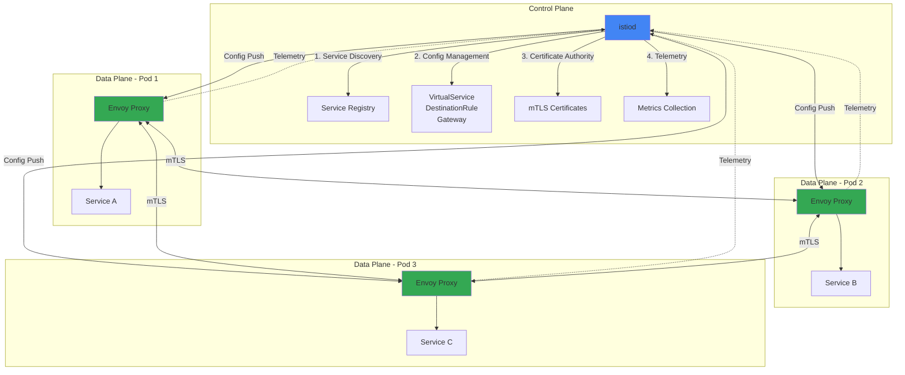
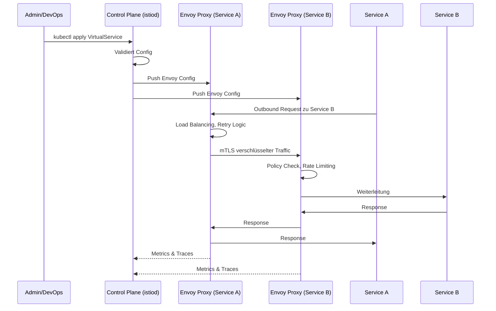

# Architektur & Komponenten von Istio

**Data Plane:**
- Envoy-Proxies als Sidecars
- Fangen Traffic ab
- Setzen Policies durch

**Control Plane (istiod):**
- Konfigurationsverteilung
- Service Discovery
- Certificate Management
- Telemetrie-Sammlung

**Zusammenspiel:**
1. High-level Config (VirtualService, DestinationRule)
2. istiod übersetzt → Envoy-Config
3. Push an alle Proxies
4. Proxies setzen um

**Traffic Flow:**

