# Vergleich mit Linkerd, Cilium, Consul

| Feature | Istio | Linkerd | Cilium | Consul |
|---------|-------|---------|--------|--------|
| **Proxy** | Envoy (C++) | Rust-Proxy | eBPF (Kernel) | Envoy |
| **Komplexität** | Hoch | Niedrig | Mittel | Mittel |
| **Overhead** | Hoch | Niedrig | Sehr niedrig | Mittel |
| **Features** | Maximal | Basis | Netzwerk-fokus | Multi-Platform |
| **K8s-Native** | Ja | Ja | Ja | Teilweise |
| **Use Case** | Enterprise, viele Features | Einfachheit | Performance | VM + K8s |

**Kernunterschiede:**
- **Linkerd:** Einfach, schnell, weniger Features
- **Cilium:** eBPF = keine Sidecars, extrem performant
- **Consul:** Multi-Plattform (VMs, Bare Metal)
- **Istio:** Feature-Champion, größte Community

📊 **Grafik:** Entscheidungsbaum

```mermaid
graph TB
    START{Welches Service Mesh?}
    
    START -->|Einfachheit wichtig?| Q1{Minimaler Overhead?}
    START -->|Max Performance?| CILIUM[Cilium<br/>eBPF-basiert<br/>Keine Sidecars]
    START -->|VMs + K8s?| CONSUL[Consul<br/>Multi-Platform<br/>HashiCorp Stack]
    START -->|Max Features?| ISTIO[Istio<br/>Feature-reich<br/>Große Community]
    
    Q1 -->|Ja| LINKERD[Linkerd<br/>Rust Proxy<br/>Schnell Setup]
    Q1 -->|Nein| Q2{Bereits Envoy Erfahrung?}
    Q2 -->|Ja| ISTIO
    Q2 -->|Nein| LINKERD
    
    style LINKERD fill:#4ecdc4
    style CILIUM fill:#ffe66d
    style CONSUL fill:#ff6b6b
    style ISTIO fill:#4285f4
```

---

**Soll ich für einzelne Abschnitte konkrete Grafiken erstellen oder reichen die Beschreibungen?**
